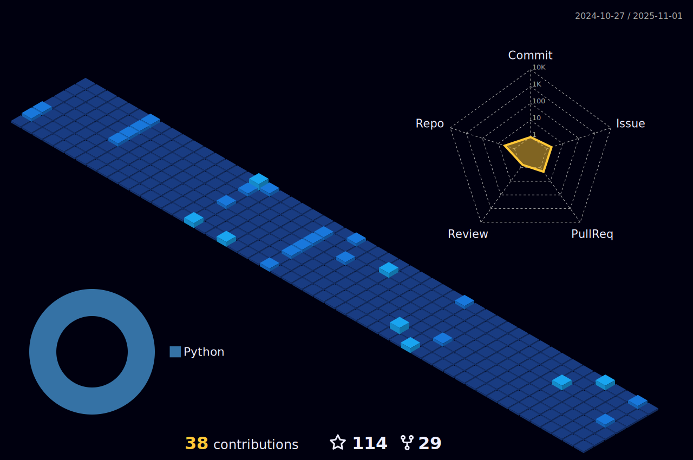

<i>he/him</i>

  <h1>Hi there, I'm QuartzWarrior! 👋</h1>

  

## Latest Project: WebGX
- Unblocked games
- Multiple domains
- Online proxy
- Constant updates
- Dynamic design
- Beautiful UI

## ~~New Projects: Slope & CookieClicker for GameFinder.ga~~

- ~~Currently working on a new Discord bot (DM me for name ideas)~~
- ~~Interested in collaborating on Python Discord bots~~
- ~~Ask me about free Discord bot hosting~~
- ~~Fun Fact: My bot, Minecraft Status, is in 1035 servers!~~

  <h2>Links</h2>
  
  
  <!---->
  
  

 

   

  

  

<!-- 
 **QuartzWarrior/QuartzWarrior** is a ✨ _special_ ✨ repository because its `README.md` (this file) appears on your GitHub profile.

Here are some ideas to get you started:

- 🔭 I’m currently working on ...
- 🌱 I’m currently learning ...
- 👯 I’m looking to collaborate on ...
- 🤔 I’m looking for help with ...
- 💬 Ask me about ...
- 📫 How to reach me: ...
- 😄 Pronouns: ...
- ⚡ Fun fact: ...
-->

